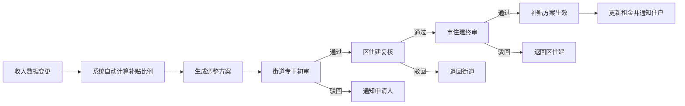

## 1. 产品概述

面向城市保障性住房的3D交互可视化综合管理与服务调度平台，覆盖公租房社区、楼栋单元、房屋户型、物业中心及市、区、街道三级住建管理部门，实现房屋全生命周期数字化管理、住户服务智能调度、违规行为实时预警与多级审批联动。

- 主要目标：通过3D可视化技术实现保障房运营的全景化、智能化管理，提升住建部门监管效率与住户服务体验
- 目标用户：市/区/街道住建管理人员、物业人员、网格员、维修工、保障房住户

## 2. 核心功能

### 2.1 用户角色

| 角色 | 登录方式 | 核心权限 |
|------|----------|----------|
| 租户 | 人脸识别登录 | 查看个人房屋信息、缴费记录、提交报修、申请维修 |
| 物业人员 | 人脸识别登录 | 查看管辖楼栋、处理报修、派单、门禁管理、查看能耗 |
| 街道专干 | 人脸识别登录 | 空置预警巡查、转租整改审批、租金补贴初审、配租摇号监督 |
| 区分局长 | 人脸识别登录 | 租金补贴复核、转租整改审批、区级运营数据查看 |
| 市住建局长 | 人脸识别登录 | 租金补贴终审、全市运营数据总览、报表导出、审批配置 |

### 2.2 功能模块

1. **3D可视化总览**：社区全景、楼栋透视、房屋户型三级场景切换
2. **房屋信息管理**：住户信息展示、租约管理、租金缴费记录
3. **门禁与人脸识别**：刷脸记录实时汇聚、空置预警、违规转租检测
4. **租金补贴管理**：自动计算补贴比例、三级审批流程
5. **配租管理**：申请人评分排序、3D大屏摇号动画、在线选房
6. **报修工单系统**：智能派单、路径动画、超时升级
7. **能耗管理**：公区照明智能调节、楼栋能耗统计、超预算预警
8. **审批工作流**：街道初审→区住建复核→市住建终审三级联动
9. **报表导出**：按季度/行政区导出Excel运营报表

### 2.3 页面详情

| 页面名称 | 模块名称 | 功能描述 |
|----------|----------|----------|
| 3D可视化大屏 | 社区全景视图 | 展示社区鸟瞰3D模型，楼栋按状态变色（正常/预警/违规/空置），支持缩放旋转 |
| 3D可视化大屏 | 楼栋单元视图 | 点击楼栋进入透视视图，显示每层每户状态，悬浮显示房屋摘要 |
| 3D可视化大屏 | 房屋户型视图 | 点击房屋进入户型详情，展示3D户型模型与住户完整信息面板 |
| 房屋详情面板 | 住户信息卡片 | 显示住户姓名、家庭人口、租约到期日、当前月租金 |
| 房屋详情面板 | 缴费记录 | 历史缴费列表，欠费高亮显示 |
| 房屋详情面板 | 门禁记录 | 近24小时人脸识别出入记录，时间轴展示 |
| 房屋详情面板 | 报修工单 | 当前及历史报修工单状态跟踪 |
| 租金补贴审批 | 补贴列表 | 待审批补贴申请列表，显示自动计算的补贴比例与调整方案 |
| 租金补贴审批 | 三级审批流 | 街道初审→区住建复核→市住建终审的审批进度可视化 |
| 配租管理 | 申请人评分 | 申请人自动评分排序榜单 |
| 配租管理 | 摇号大屏 | 3D滚动动画实时展示摇号抽签过程与中签结果 |
| 配租管理 | 在线选房 | 绿色高亮显示可用房源，支持点击选房 |
| 报修工单 | 工单列表 | 按状态分类的工单列表（待派单/进行中/已完成/已超时） |
| 报修工单 | 智能派单 | 根据故障类型和位置自动派单至最近维修工，蓝色路径动画展示 |
| 能耗管理 | 楼栋能耗统计 | 各楼栋能耗对比柱状图，超预算楼栋边框变橙 |
| 能耗管理 | 节能建议 | 弹出节能优化建议面板 |
| 预警中心 | 空置预警 | 连续10日无人脸记录的房屋黄色闪烁预警，自动推送巡查任务 |
| 预警中心 | 转租预警 | 非登记人脸超3次的房屋红色高亮，门禁锁定，生成整改工单 |
| 报表导出 | 运营报表 | 按季度/行政区筛选，导出Excel含空置率、欠费率、报修响应时间、转租查处统计 |
| 权限管理 | 操作日志 | 所有人脸识别登录记录与操作审计日志 |

## 3. 核心流程

### 3.1 租金补贴调整流程
住户收入变化触发系统自动计算补贴比例，生成调整方案后推送至街道专干初审，通过后送至区住建复核，最终由市住建终审，审批通过后补贴方案生效并同步更新租金。

### 3.2 空置预警与巡查流程
门禁人脸识别数据实时汇聚，系统检测单户连续10日无出入记录时，房屋模型变黄闪烁并生成空置预警，自动推送巡查任务至对应网格员。

### 3.3 违规转租检测流程
摄像头实时抓拍人脸与登记住户比对，非登记人员出入超3次触发预警，房屋模型变红并锁定门禁，生成转租整改工单进入街道-区住建联合审批流程。

### 3.4 报修派单流程
住户提交维修申请，系统根据故障类型和位置自动匹配最近维修工并派单（蓝色路径动画），超2小时未接单自动升级至物业主管。

## 4. 用户界面设计

### 4.1 设计风格
- **主色调**：深邃科技蓝(#0A1628)为背景主色，政务蓝(#1E54B7)为主题色，状态色：正常绿(#10B981)、预警黄(#F59E0B)、违规红(#EF4444)、空置橙(#F97316)、选房绿(#34D399)
- **按钮风格**：圆角矩形，渐变填充，微发光悬浮效果，审批类按钮采用金色描边
- **字体**：标题使用"思源黑体 Heavy"，数据展示使用"JetBrains Mono"等宽字体，正文使用"思源黑体 Regular"
- **布局风格**：全屏3D场景居中，左右两侧信息面板悬浮，顶部导航栏，底部状态指示灯
- **视觉特效**：玻璃拟态面板、辉光边框、粒子背景、3D模型状态动画（闪烁、呼吸、路径流动）

### 4.2 页面设计概览

| 页面名称 | 模块名称 | UI元素 |
|----------|----------|--------|
| 3D可视化大屏 | 社区全景 | 深色渐变背景、3D社区模型、楼栋状态发光边框、右上角统计仪表盘、底部时间轴 |
| 3D可视化大屏 | 楼栋透视 | 半透明楼栋截面、逐层展开动画、房屋模型悬浮高亮、左侧详情抽屉 |
| 房屋详情面板 | 信息卡片 | 玻璃拟态面板、头像占位、关键指标数据卡片、进度条展示租约进度 |
| 配租摇号大屏 | 摇号动画 | 3D数字滚动球、粒子爆发特效、中签名单滚动LED风格、倒计时动画 |
| 审批工作流 | 流程节点 | 节点连接线流动动画、审批状态图标、时间轴记录 |
| 能耗统计 | 柱状图 | 渐变填充柱、超预算橙色警示线、悬浮数值标签 |

### 4.3 响应式
桌面端优先设计，适配1920×1080及以上大屏展示；次要面板可折叠；触控设备支持手势缩放旋转3D场景。

### 4.4 3D场景指引
- **环境/HDRI**：深蓝色科技氛围，程序化星空粒子背景，柔和环境光配合方向性主光
- **光照设置**：HemisphereLight环境光 + DirectionalLight平行光投射阴影，各楼栋根据状态添加点光源辉光
- **相机设置**：默认社区全景使用PerspectiveCamera 45°视场角，支持OrbitControls轨道控制，切换楼栋时相机动画过渡
- **构图与焦点**：3D场景居中占70%视口，左右信息面板各占15%，楼栋模型为视觉焦点
- **交互与动画**：楼栋悬浮时轻微放大高亮，点击切换视图时镜头平滑飞行，预警房屋黄色呼吸闪烁，违规房屋红色脉冲闪烁，派单时蓝色贝塞尔曲线路径流动
- **后处理效果**：Bloom泛光效果增强发光边框，轻微Vignette暗角聚焦中心，SSAO环境光遮蔽增强空间感
- **性能预算**：单楼栋不超过2000面，全场景控制在5万面以内，使用InstancedMesh优化重复房屋模型
