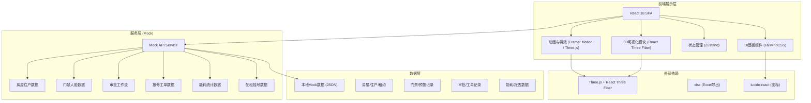
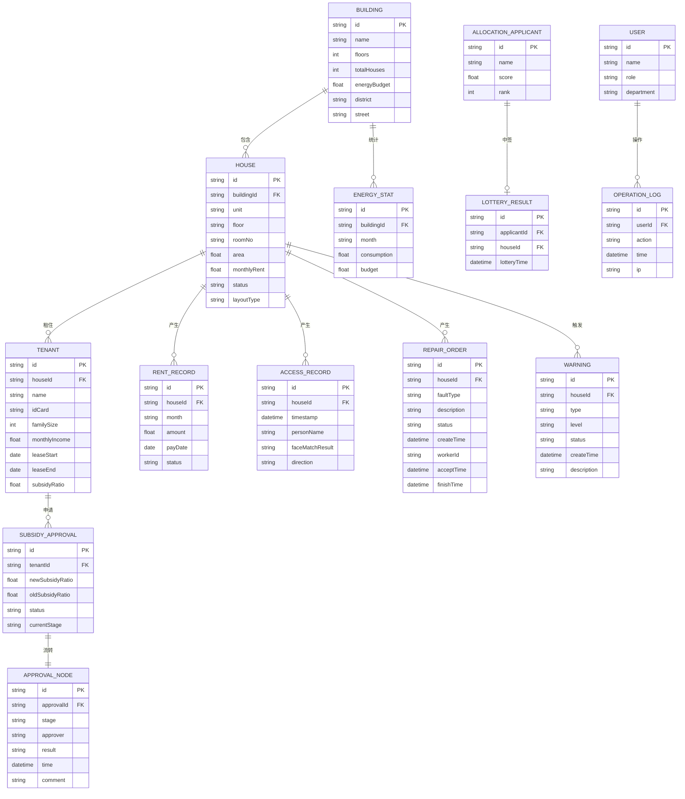

## 1. 架构设计



## 2. 技术描述

- **前端框架**：React 18 + TypeScript
- **构建工具**：Vite 5
- **样式方案**：TailwindCSS 3 + PostCSS
- **3D渲染**：Three.js + @react-three/fiber + @react-three/drei + @react-three/postprocessing
- **状态管理**：Zustand（轻量状态管理）
- **动画**：Framer Motion（UI动画）+ Three.js Animation（3D动画）
- **图表**：自定义SVG图表（能耗统计、审批流程）
- **图标**：lucide-react
- **Excel导出**：xlsx (SheetJS)
- **后端**：无后端，使用本地Mock数据模拟

## 3. 路由定义

| 路由 | 用途 |
|------|------|
| / | 3D可视化大屏主入口（社区全景视图） |
| /building/:id | 楼栋透视视图 |
| /house/:id | 房屋详情与户型视图 |
| /approval | 租金补贴三级审批中心 |
| /allocation | 配租管理（摇号+选房） |
| /repair | 报修工单调度中心 |
| /energy | 能耗统计管理 |
| /warnings | 预警中心（空置/转租） |
| /reports | 运营报表导出 |
| /logs | 操作日志与登录审计 |

## 4. 数据模型

### 4.1 数据模型定义（ER图）



### 4.2 目录结构设计

```
src/
├── components/
│   ├── ui/                    # 通用UI组件（按钮、卡片、抽屉等）
│   ├── three3d/              # 3D场景组件
│   │   ├── CommunityScene.tsx   # 社区全景
│   │   ├── BuildingScene.tsx    # 楼栋透视
│   │   ├── HouseScene.tsx       # 户型详情
│   │   ├── Building.tsx         # 单楼栋模型
│   │   ├── HouseUnit.tsx        # 单房屋模型
│   │   └── Effects.tsx          # 后处理特效
│   ├── panels/               # 信息面板组件
│   │   ├── HouseDetailPanel.tsx
│   │   ├── StatsDashboard.tsx
│   │   ├── ApprovalFlowPanel.tsx
│   │   └── WarningListPanel.tsx
│   ├── modules/              # 功能模块组件
│   │   ├── LotteryScreen.tsx
│   │   ├── RepairDispatch.tsx
│   │   ├── EnergyChart.tsx
│   │   └── ReportExport.tsx
│   └── layout/               # 布局组件
│       ├── TopNav.tsx
│       ├── SidePanel.tsx
│       └── StatusBar.tsx
├── store/                    # Zustand状态管理
│   ├── useHouseStore.ts
│   ├── useApprovalStore.ts
│   ├── useWarningStore.ts
│   └── useUserStore.ts
├── data/                     # Mock数据
│   ├── buildings.ts
│   ├── houses.ts
│   ├── tenants.ts
│   ├── accessRecords.ts
│   ├── repairOrders.ts
│   ├── approvals.ts
│   └── energyStats.ts
├── services/                 # 业务服务层
│   ├── api.ts
│   ├── approvalService.ts
│   ├── warningService.ts
│   └── exportService.ts
├── types/                    # TypeScript类型定义
│   └── index.ts
├── utils/                    # 工具函数
│   ├── helpers.ts
│   └── constants.ts
├── App.tsx
├── main.tsx
└── index.css
```

## 5. 核心技术决策说明

1. **React Three Fiber vs 原生Three.js**：采用R3F将Three.js能力以声明式React组件方式暴露，便于状态驱动3D场景，与UI组件共享状态。
2. **Zustand作为状态管理**：相比Redux更轻量，避免样板代码，支持跨组件共享3D场景与业务面板状态。
3. **玻璃拟态UI设计**：TailwindCSS + backdrop-blur + 半透明渐变实现科技感面板，与深色3D场景形成层次。
4. **后处理栈**：Bloom泛光突出楼栋状态色边框，SSAO增强空间感，Vignette聚焦视口中心。
5. **InstancedMesh优化**：同户型大量重复房屋使用实例化网格，降低Draw Call，保证5万面级别场景60fps。
6. **本地Mock优先**：所有后端接口以Mock数据形式实现，确保前端独立可运行，后续可无缝替换为真实API。
